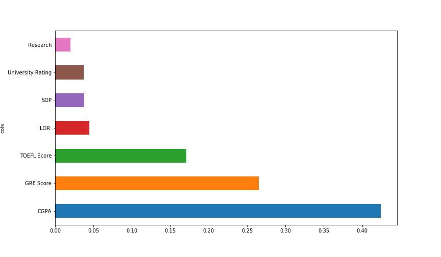

<h1 align="center">IBM-Project-53031-1661258910</h1>
<h2 align="center">University Admit Eligibility Predictor</h2>
<h3 align="center">Team Members: Vaishnavi.V, Saraavathy.P, Steffi Grace.M, Harini.K </h3>
<h3>Abstract</h3>
Many students are repeatedly facing difficulties in finding admissions to university.The aim of this project is to help students in shortlisting their universities.
When students come from rural places, they find it hard to go along with the formal procedures. So, this application helps them a lot and eases out their fear. 
University eligibility predictor helps to predict students About their admissions in college. This helps the student not only to help in filling out the application
forms but also give the students an idea about their future college by calculating their cut off.
<h3>Project Objective</h3>
<li>Evaluation metrics</li>
<li>Applying different ML algorithms to determine the probability of acceptance in a particular university.</li>
<li>Build a web application using the Flask framework.</li>
<li>To grab insights from data through visualization.</li>
<li>To understand regression and classification problems.</li>
<h3> Dataset Overview</h3>
<li>Dataset: Graduate Admissions Dataset</li>
<li>Source: Kaggle</li>
<li>Metrics: 500 rows, 9 columns</li>
<b>About</b>: The graduate studies dataset is a dataset which describes the acceptance probability of a student based on the following
 parameters:
<ol>
<li>GRE Score (out of 340)</li>
<li>TOEFL Score (out of 120)</li>
<li> IELTS Score (out of 9)</li>
<li>University Rating (out of 5)</li>
<li>Statement of Purpose/ SOP (out of 5)</li>
<li>Letter of Recommendation/ LOR (out of 5)</li>
<li>Research Experience (either 0 or 1)</li>
<li>Chance of Admittance (ranging from 0 to 1)</li>
</ol>
This dataset was built with the purpose of helping students to shortlist universities based on their profiles. The predicted output gives them a fair idea about their chances for a particular university. This dataset is inspired by the UCLA Graduate Dataset from Kaggle.
 

<h3>Architecture Diagram</h3>

